# ToDit 프로젝트 전체 코드리뷰 (상세·다이어그램)

> **목적**: 사소한 로직까지 포함한 완전 코드리뷰. 시각적 다이어그램을 적극 활용.
> 작성일: 2026-03-15

---

## 목차

1. [시스템 아키텍처 개요](#1-시스템-아키텍처-개요)
2. [전체 데이터 흐름 다이어그램](#2-전체-데이터-흐름-다이어그램)
3. [파싱 파이프라인 상세 (POST /api/parse)](#3-파싱-파이프라인-상세-post-apiparse)
4. [업로드 → 파싱 시퀀스 (클라이언트·API)](#4-업로드--파싱-시퀀스-클라이언트api)
5. [인증·미들웨어·라우트 보호](#5-인증미들웨어라우트-보호)
6. [lib 모듈 의존관계 및 세부 로직](#6-lib-모듈-의존관계-및-세부-로직)
7. [API 라우트별 상세 로직](#7-api-라우트별-상세-로직)
8. [Supabase 테이블·스토리지 구조](#8-supabase-테이블스토리지-구조)
9. [페이지·클라이언트 상태 흐름](#9-페이지클라이언트-상태-흐름)
10. [에러·예외 처리 흐름](#10-에러예외-처리-흐름)
11. [보안·불변 규칙 정리](#11-보안불변-규칙-정리)
12. [공통 컴포넌트·레이아웃 세부 로직](#12-공통-컴포넌트레이아웃-세부-로직)
13. [추가 시퀀스·상태 다이어그램](#13-추가-시퀀스상태-다이어그램)
- [부록: 파일별 체크리스트](#부록-파일별-체크리스트-사소한-로직-포함)

---

## 1. 시스템 아키텍처 개요

### 1.1 고수준 구성도

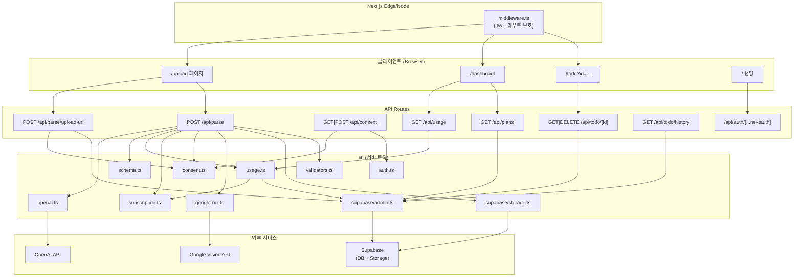

### 1.2 레이어별 역할

| 레이어 | 역할 |
|--------|------|
| **미들웨어** | JWT 검증, 보호 라우트(/dashboard, /todo, /upload) 접근 시 비인증 → `/` 리다이렉트 |
| **API** | 세션·약관·입력 검증 후 lib 호출, JSON 응답 |
| **lib** | 비즈니스 로직 단일 책임(usage, subscription, OCR, LLM, 스키마 검증 등) |
| **Supabase** | saved_todo, user_usage, subscriptions, user_consents, parse-temp 스토리지 |

---

## 2. 전체 데이터 흐름 다이어그램

### 2.1 “이미지 업로드 → ActionPlan 생성” E2E

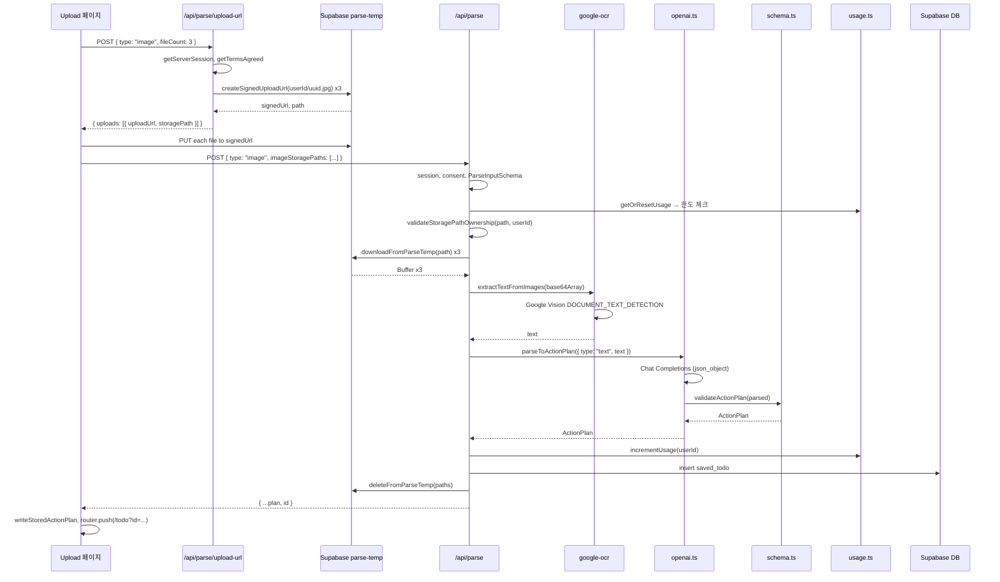

### 2.2 “텍스트 직접 입력 → 파싱” 단순 흐름

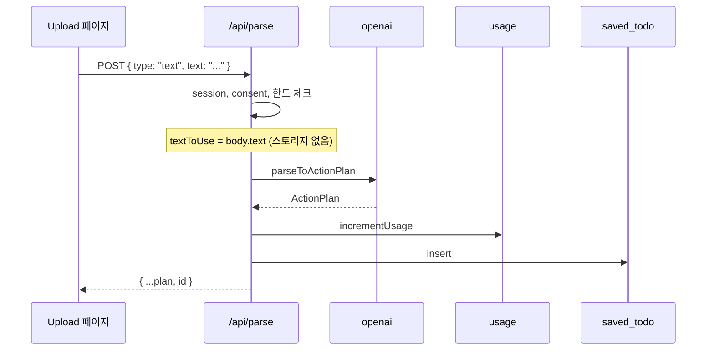

---

## 3. 파싱 파이프라인 상세 (POST /api/parse)

### 3.1 단계별 플로우차트

```mermaid
flowchart TD
  A[POST /api/parse] --> B{OPENAI_API_KEY?}
  B -->|없음| C[503 + 메시지]
  B -->|있음| D{NEXTAUTH_SECRET?}
  D -->|있음| E[getServerSession]
  D -->|없음| F[session = null]
  E --> G{session?.user?.id?}
  G -->|없음| H[401 로그인 필요]
  G -->|있음| I[getTermsAgreed]
  I --> J{agreed?}
  J -->|false| K[403 약관 동의 필요]
  J -->|true| L[request.json]
  F --> L
  L --> M{JSON 파싱 성공?}
  M -->|실패| N[400 Invalid JSON]
  M -->|성공| O[ParseInputSchema.safeParse]
  O --> P{valid?}
  P -->|실패| Q[400 첫 번째 issue 메시지]
  P -->|성공| R[getTier, finalOptions]
  R --> S{session?.user?.id?}
  S -->|있음| T[getOrResetUsage]
  T --> U{tier===free && count >= 20?}
  U -->|예| V[402 LIMIT_EXCEEDED]
  U -->|아니오| W[스토리지 경로 검증]
  S -->|없음| W
  W --> X{type별 텍스트 추출}
  X -->|pdf+path| Y[downloadFromParseTemp → pdf-parse]
  X -->|pdf+base64| Z[Buffer.from base64 → pdf-parse]
  X -->|text| AA[textToUse = text]
  X -->|image+paths| AB[download → extractTextFromImages]
  X -->|image+base64| AC[extractTextFromImages]
  Y --> AE{성공?}
  Z --> AE
  AB --> AE
  AC --> AE
  AE -->|실패| AD[502 또는 400, path 사용 시 deleteFromParseTemp]
  AE -->|성공| AF[parseToActionPlan]
  AF --> AG{성공?}
  AG -->|실패| AH[500 Parse failed]
  AG -->|성공| AI{tier===free?}
  AI -->|예| AJ[plan.actions에서 priority 제거]
  AI -->|아니오| AK[session이면 incrementUsage]
  AJ --> AK
  AK --> AL[saved_todo insert, id 반환]
  AL --> AM[200 { ...plan, id }]
  AM --> AN[finally: deleteFromParseTemp]
  AH --> AN
  AD --> AN
```

### 3.2 type별 텍스트 추출 분기 (세부 로직)

| type | 입력 소스 | 처리 |
|------|-----------|------|
| **pdf** | `pdfStoragePath` | `downloadFromParseTemp` → pdf-parse; 실패 시 `deleteFromParseTemp` 후 502 |
| **pdf** | `pdfBase64` | `Buffer.from(pdfBase64,'base64')` → pdf-parse; 실패 시 400 (스토리지 삭제 없음) |
| **text** | `text` | `textToUse = text` |
| **image** | `imageStoragePaths` (배열 길이>0) | 각 path `downloadFromParseTemp` → base64 배열 → `extractTextFromImages`; 실패 시 삭제 후 502 |
| **image** | `imagesBase64` 또는 `imageBase64` | base64 배열 구성 후 `extractTextFromImages`; 실패 시 502 |

- `textToUse === undefined`이면 400 "Missing content".
- **스토리지 경로 검증**: `pdfStoragePath` 또는 `imageStoragePaths` 사용 시 `validateStoragePathOwnership(path, userId)` 호출. 실패 시 403, 메시지는 `e.message` 또는 "잘못된 스토리지 경로입니다."

### 3.3 옵션·티어 적용

- **finalOptions**: `tier === "pro"`이면 `options` 그대로, 아니면 `{ model: "gpt-4o-mini", usePriority: false }` 고정.
- **사용량 증가**: `session?.user?.id`가 있을 때만 `incrementUsage(session.user.id)` 호출 (파싱 성공 후).
- **DB 저장**: 동일 조건에서 `saved_todo`에 insert, `.select("id").single()`로 `savedPlanId`를 응답에 포함.
- **finally**: `storagePathsToDelete.length > 0`이면 항상 `deleteFromParseTemp(storagePathsToDelete)` 실행 (성공/실패 무관).

---

## 4. 업로드 → 파싱 시퀀스 (클라이언트·API)

### 4.1 Upload 페이지 제출 흐름

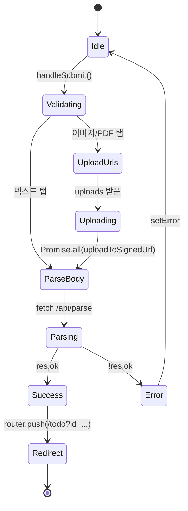

### 4.2 upload-url API 내부

```mermaid
flowchart LR
  A[POST body] --> B{session?}
  B -->|없음| C[401]
  B -->|있음| D[getTermsAgreed]
  D --> E{agreed?}
  E -->|아니오| F[403]
  E -->|예| G[body.type, fileCount]
  G --> H{type in image,pdf?}
  H -->|아니오| I[400]
  H -->|예| J[count = pdf? 1 : clamp(fileCount,1,30)]
  J --> K[userId/crypto.randomUUID().ext]
  K --> L[createSignedUploadUrl]
  L --> M[200 { uploads }]
```

- `ext`: type === "pdf" ? "pdf" : "jpg".

---

## 5. 인증·미들웨어·라우트 보호

### 5.1 미들웨어 의사코드

```
matcher: ["/", "/dashboard/:path*", "/todo/:path*", "/upload/:path*"]

if (!token) {
  if (pathname in { /dashboard, /todo, /upload }) → redirect("/")
  else → next()
} else {
  if (pathname === "/" && searchParams.get("landing") !== "1") → redirect("/dashboard")
  else → next()
}
```

### 5.2 인증 체인 다이어그램

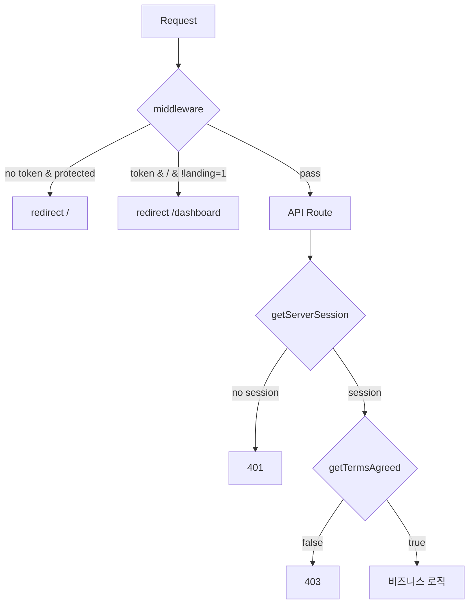

### 5.3 auth-options 요약

- **Provider**: Google only.
- **NEXTAUTH_URL**: 미설정 시 `VERCEL_URL` → `https://${VERCEL_URL}` 또는 `http://localhost:3000`.
- **session callback**: `session.user.id = token.sub`.
- **pages.signIn**: `"/upload"` (로그인 후 업로드 페이지로).

---

## 6. lib 모듈 의존관계 및 세부 로직

### 6.1 모듈 의존성 그래프

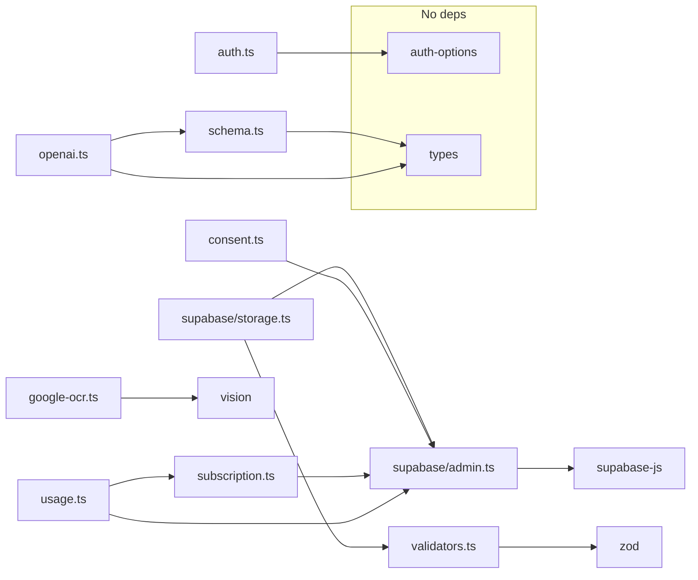

### 6.2 openai.ts — parseToActionPlan 세부

- **모델**: `options?.model ?? "gpt-4o-mini"`. `"gpt-5-mini"` → `"gpt-4o"`로 치환.
- **프롬프트 보강**:
  - `customCategory` 있음 → 시스템 프롬프트 끝에 카테고리 강제 문단 추가.
  - `usePriority === false` → "Set all priorities to medium" 문단 추가.
  - `detailLevel === "brief"` → 3~5개 고수준 액션만 지시.
  - `detailLevel === "detailed"` → 최대 세분화 지시.
- **응답 처리**: `completion.choices[0]?.message?.content`가 없거나 비문자열이면 throw. `JSON.parse(raw)` 실패 시 throw.
- **검증 후 보정**: `validateActionPlan(parsed)` 호출. 그 다음 `options?.customCategory`가 있고 "기타"가 아니면 `validated.category = options.customCategory` 강제.

### 6.3 schema.ts — validateActionPlan 세부

- **category**: `parseCategory(o.category)` → 목록에 없으면 "기타".
- **actions**: 배열 map `parseAction` → null 제거. 각 항목: `task`(string, 빈문자열 가능), `due`(string|null), `priority`(유효하지 않으면 "medium"), `done`(boolean).
- **폴백 날짜**:
  - `withDue` = due가 있는 액션들.
  - `earliestDue` = withDue 중 최소 날짜 문자열 (없으면 null).
  - `baseDate` = earliestDue ? new Date(earliestDue + "T12:00:00") : today.
  - `fallbackDate` = baseDate - 1일, ISO 날짜만.
  - due가 null인 액션에 `due: fallbackDate` 설정.
- **requirements, unknowns, keywords, keyPoints**: 배열 필터로 string만 유지.
- **analysis, title**: string 아니면 "".

### 6.4 usage.ts — getOrResetUsage / incrementUsage

**getOrResetUsage**:
- `getTier(userId)` → limit = pro ? null : 20.
- `user_usage` 단일 행 조회. 없으면 insert (balance=0, last_refill_at=이번 달 1일), 반환.
- 있으면: `last_refill_at`의 “월” < 현재 “월”이면 update(balance=0, last_refill_at=이번 달 1일) 후 count=0으로 반환.
- displayName이 있으면 update 시 `display_name` 포함.
- 반환: `{ count: balance ?? 0, limit, last_reset_at }`.

**incrementUsage**:
- Pro: balance+1 무조건 update, true 반환.
- Free: 현재 balance >= 20이면 false. 아니면 balance+1 update, 성공 여부 반환.

### 6.5 validators.ts — 경로 검증

- **sanitizeStoragePath**: `..` 포함 또는 `/`/`\`로 시작 시 throw. `SAFE_PATH_RE` = `/^[a-zA-Z0-9_\-/]+\.[a-zA-Z0-9]+$/` 불일치 시 throw.
- **validateStoragePathOwnership**: sanitize 후 `path.startsWith(\`${userId}/\`)` 아니면 throw.

---

## 7. API 라우트별 상세 로직

### 7.1 GET /api/usage

```mermaid
flowchart TD
  A[GET] --> B[session]
  B --> C{session?.user?.id?}
  C -->|없음| D[401]
  C -->|있음| E[getOrResetUsage(id, name)]
  E --> F{usage?}
  F -->|null| G[500]
  F -->|있음| H[200 usage]
```

### 7.2 GET /api/plans

- **쿼리**: PaginationSchema (page, category, search). pageSize=10.
- **쿼리 빌더**: `saved_todo`, `user_id=session.user.id`. category !== "all"이면 `plan->>category` = category. search 있으면 `title ilike %search%`.
- **정렬**: created_at 내림차순. range((page-1)*10, page*10-1).
- **응답**: `{ data, totalCount, page, pageSize }`.

### 7.3 GET /api/todo/[id]

- **params.id** → TodoIdSchema (UUID). 실패 시 400.
- **saved_todo**에서 id로 single 조회. 없으면 404.
- **data.user_id !== session.user.id** → 403.
- **성공**: 200, body = `data.plan` (ActionPlan JSON).

### 7.4 DELETE /api/todo/[id]

- UUID 검증 동일. 먼저 `select("user_id")`로 소유권 확인. 없으면 404, user_id 불일치 시 403. 이후 delete, 성공 시 200 { success: true }.

### 7.5 GET /api/todo/history

- session 필수. `saved_todo`에서 `user_id` 일치, `select("id", "title", "created_at")`, created_at 내림차순, limit 5. 200에 배열 반환.

### 7.6 GET /api/consent

- session 없으면 401, body `{ agreed: false }`. 있으면 getTermsAgreed 후 200 `{ agreed }`.

### 7.7 POST /api/consent

- session 없으면 401. setTermsAgreed 호출, 성공 200 { success: true }, 실패 500 { error }.

---

## 8. Supabase 테이블·스토리지 구조

### 8.1 ER 관계도

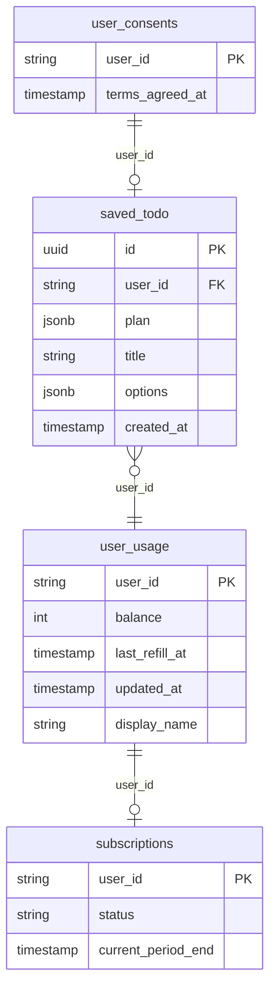

### 8.2 parse-temp 스토리지

- **버킷명**: `parse-temp`.
- **경로 형식**: `{userId}/{uuid}.{ext}` (ext: jpg | pdf).
- **생명주기**: upload-url으로 생성 → 클라이언트 PUT → parse API에서 download 후 **항상** finally에서 delete.

### 8.3 테이블 용도 요약

| 테이블 | 용도 |
|--------|------|
| **user_usage** | 월간 생성 횟수(count=balance), 월 리셋 시점(last_refill_at), Pro/Free에 따라 limit 적용 |
| **subscriptions** | Pro 여부 (status=active, current_period_end > now) |
| **user_consents** | 이용약관·개인정보 동의 시점 (terms_agreed_at) |
| **saved_todo** | 사용자별 저장 플랜 (plan JSONB, title, options) |

---

## 9. 페이지·클라이언트 상태 흐름

### 9.1 Upload 페이지 상태

- **activeTab**: "text" | "image" | "pdf".
- **text, imageFiles, pdfFile**: 입력 소스.
- **usage, history, showConsentModal**: 사용량·이력·약관 모달.
- **Pro 옵션**: selectedModel, usePriority, detailLevel, customCategory. Free면 usage 로드 시 usePriority=false로 덮음.
- **제출**: 텍스트면 body { type, text, options }. 이미지/PDF면 upload-url → PUT → body { type, imageStoragePaths | pdfStoragePath, options } → /api/parse. 성공 시 writeStoredActionPlan, router.push(/todo?id=...). 최소 로딩 시간(텍스트 5초, 이미지/PDF 10초) 유지 후 setLoading(false), fetchUsage().

### 9.2 Dashboard 페이지 상태

- **historyPlans, lastPlan, usage, search, category, currentPage, totalCount**.
- **검색**: tempSearch 500ms 디바운스 후 search 반영, currentPage=1로 리셋.
- **fetchPlans**: /api/plans?page&category&search. currentPage===1 && category==="all" && search===""이면 첫 항목을 lastPlan으로.
- **handlePlanClick(id)**: router.push(`/todo?id=${id}`).

### 9.3 Todo 페이지 상태

- **id**: searchParams.get("id"). 없으면 router.replace("/dashboard").
- **로드**: /api/todo/[id] → setResult. /api/usage → setUsage.
- **toggleAction(index)**: result.actions[index].done 토글, writeStoredActionPlan으로 세션 스토리지 갱신 (DB 반영 없음).
- **정렬**: sortBy "none" | "date" | "priority"에 따라 actions 정렬 표시.
- **편집 모드**: isEditing, draftResult. 저장 시 로컬 상태만 갱신 (API 미호출).

### 9.4 action-plan-session.ts

- **키**: `todit_last_result`.
- **값**: `{ plan: ActionPlan, userId: string, timestamp: number }`.
- **readStoredActionPlan(userId)**: 저장된 userId와 일치할 때만 plan 반환, 아니면 null.
- **writeStoredActionPlan(plan, userId)**: 위 구조로 sessionStorage에 저장.
- **clearStoredActionPlan()**: Navbar 로그아웃 시 호출.

---

## 10. 에러·예외 처리 흐름

### 10.1 Parse API HTTP 상태 코드

| 코드 | 조건 |
|------|------|
| 503 | OPENAI_API_KEY 없음. 또는 upload-url에서 Supabase 없음. |
| 401 | NEXTAUTH_SECRET 있는데 session 없음. 또는 upload-url/usage/plans/todo/consent에서 session 없음. |
| 403 | 약관 미동의. 또는 스토리지 경로 소유권 불일치. 또는 todo [id] 소유권 불일치. |
| 400 | JSON 파싱 실패. ParseInputSchema 실패. 또는 type별 필수 필드 없음(Missing content). 또는 pdfBase64 파싱 실패. |
| 402 | Free 티어이고 usage.count >= 20 (code: "LIMIT_EXCEEDED"). |
| 502 | PDF 다운로드/파싱 실패. 또는 이미지 OCR 실패 (스토리지 사용 시 삭제 후 반환). |
| 500 | parseToActionPlan throw. 또는 setTermsAgreed 실패. 또는 DB/usage 조회 실패 등. |

### 10.2 클라이언트 에러 처리 (Upload)

- upload-url 실패 → errData.error 또는 기본 메시지 throw → setError.
- /api/parse 실패 → payload.error 또는 기본 메시지 throw → setError.
- 저장 id 없이 200 오면 "결과를 성공적으로 저장하지 못했습니다..." throw.

---

## 11. 보안·불변 규칙 정리

### 11.1 보안 경계

```mermaid
flowchart LR
  subgraph Untrusted
    Body[Request Body]
    Params[Path/Query]
  end
  subgraph Validated
    Zod[Zod Schema]
    PathOwnership[validateStoragePathOwnership]
    RowOwnership[data.user_id === session.user.id]
  end
  Body --> Zod
  Params --> Zod
  StoragePaths --> PathOwnership
  DB Rows --> RowOwnership
```

- **스토리지 경로**: 반드시 `userId/` 접두사 + sanitize (트래버설·절대경로 차단).
- **saved_todo**: GET/DELETE 시 항상 user_id 비교.
- **admin 클라이언트**: RLS 우회이므로 서버에서만 사용, 수동 소유권 검증 필수.

### 11.2 비즈니스 불변 규칙 (CLAUDE.md 정합)

1. 파이프라인 순서: 한도(사용량) 체크 → OCR/텍스트 추출 → LLM → 검증 → 사용량 증가 → DB 저장 → 스토리지 삭제.
2. 사용량 증가는 파싱 성공(validateActionPlan 통과) 후에만 수행.
3. OCR/텍스트 추출 실패 시 LLM 호출하지 않음.
4. calculateParseCost 대신 **월간 생성 횟수(usage)** 로 제한 (FREE_MONTHLY_LIMIT=20).
5. getOrResetUsage / incrementUsage가 월 리셋·증가의 단일 소스.
6. 모델 기본값 gpt-4o-mini. response_format json_object 유지.
7. parse-temp 파일은 매 요청 후(성공/실패) 삭제.
8. 인증 체인: session → consent → 비즈니스 로직. 엔드포인트가 이를 우회하지 않음.

---

## 12. 공통 컴포넌트·레이아웃 세부 로직

### 12.1 Navbar

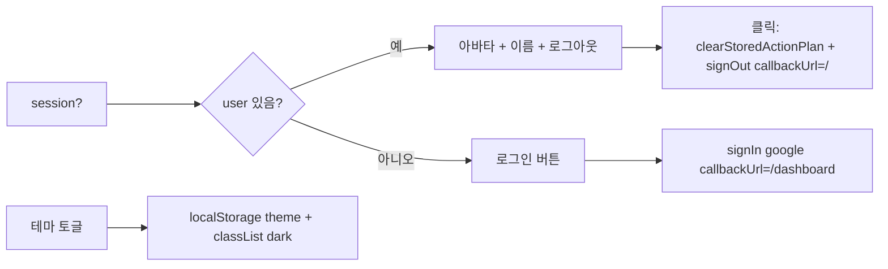

- **다크 모드**: 초기값은 `useEffect`에서 `document.documentElement.classList.contains("dark")`로 설정. 토글 시 classList 추가/제거 + `localStorage.setItem("theme", "light"|"dark")`.
- **로그아웃**: 반드시 `clearStoredActionPlan()` 후 `signOut({ callbackUrl: "/" })` 호출로 세션 스토리지의 최근 결과 삭제.

### 12.2 Footer

- **pathname** 기준: `pathname === "/" || pathname === "/dashboard"`일 때만 **풀 푸터** 표시 (로고, 이용약관/개인정보처리방침 링크, 상호/대표/사업자번호/주소/연락처).
- 그 외 경로: **미니 푸터**만 표시 (`© Aiden Development. All Rights Reserved.`).

### 12.3 Providers

- **SessionProvider** (next-auth/react)로 앱을 감싸서 `useSession`, `signIn`, `signOut` 등 클라이언트에서 세션 사용 가능.

### 12.4 루트 레이아웃 (layout.tsx)

- **메타데이터**: metadataBase, title, description, favicon, openGraph, twitter.
- **viewport**: device-width, initialScale=1, maximumScale=1, userScalable=false.
- **head**: AdSense 스크립트, 다크 테마 초기화 인라인 스크립트 (`localStorage theme === 'dark' || !setting`이면 `document.documentElement.classList.add('dark')`).
- **body**: Providers → flex 컨테이너(minHeight 100vh) → Navbar, main(children), Footer.

---

## 13. 추가 시퀀스·상태 다이어그램

### 13.1 스키마 검증 흐름 (validateActionPlan)

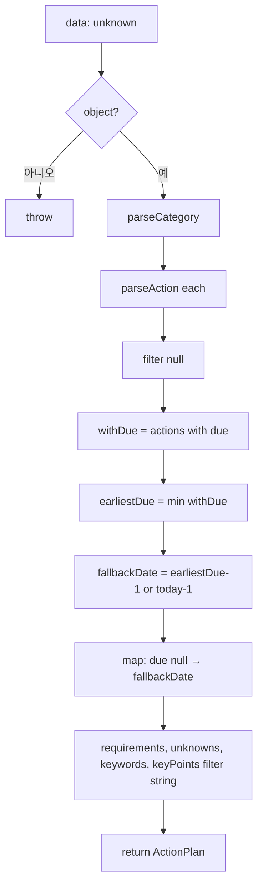

### 13.2 Google OCR 내부

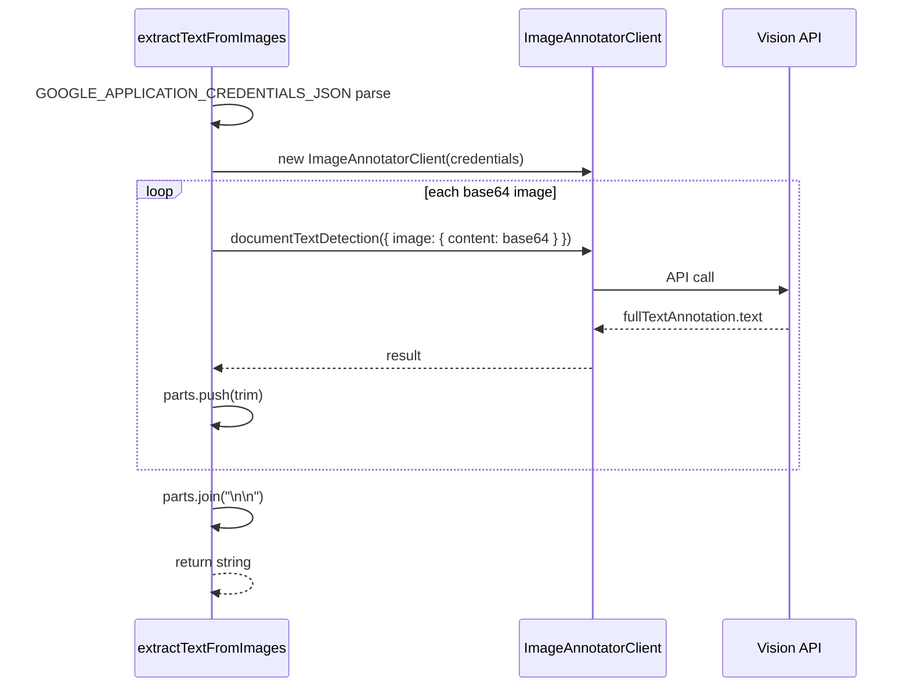

### 13.3 월간 사용량 리셋 로직 (getOrResetUsage)

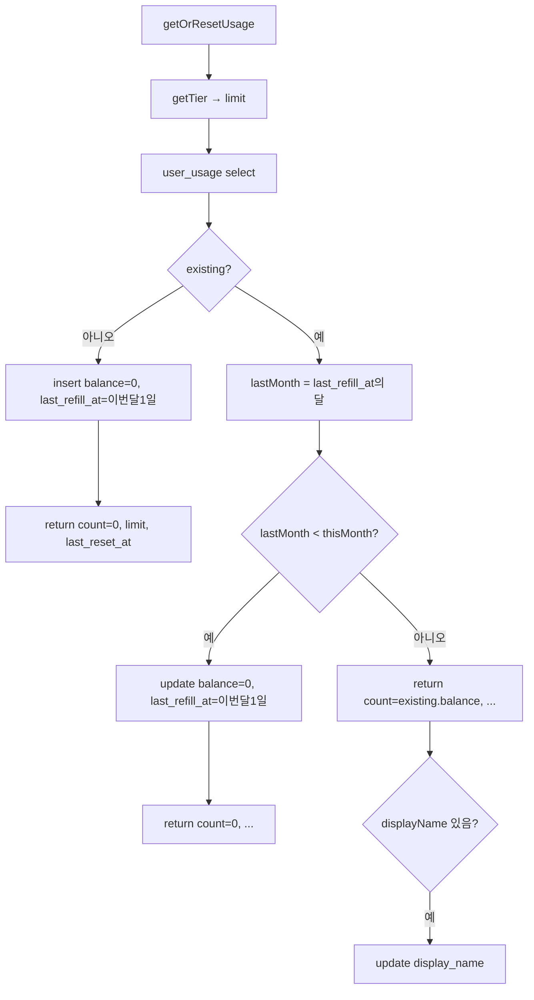

---

## 부록: 파일별 체크리스트 (사소한 로직 포함)

### app/api/parse/route.ts

- [x] PDF_MAX_BYTES 정의(10MB) — 현재 코드에서 직접 사용하는 곳 없음(클라이언트/upload-url에서 제한 가능).
- [x] session이 null일 수 있음 → userId 없을 때 스토리지 검증 스킵(validateStoragePathOwnership 호출 안 함).
- [x] hasImageStorage(type, paths): type==="image" && Array.isArray(paths) && paths.length>0.
- [x] image 입력 시 type을 "text"로 바꿔 parseToActionPlan에 전달 (이미 텍스트 추출 완료이므로).

### app/api/parse/upload-url/route.ts

- [x] fileCount 수치: pdf면 1, image면 1~30 clamp.
- [x] Zod 미사용, 수동으로 type/fileCount 검증.

### lib/usage.ts

- [x] Pro는 incrementUsage에서 한도 체크 없이 balance만 +1.
- [x] Free는 getOrResetUsage에서 이미 402를 막았으므로, incrementUsage 시점에는 보통 currentCount < 20. 이중 방어로 currentCount >= 20이면 false 반환.

### lib/consent.ts

- [x] getTermsAgreed: DB 미설정(supabase null 또는 data 없음) 시 true 반환(동의로 간주). CLAUDE에는 “동의 필수”이므로 실제로는 consent API/모달로 동의 유도.

### lib/subscription.ts

- [x] getPlanLimit(_tier): Free/Pro 모두 10 반환. getImageLimit: Free 5, Pro 50.

---

*이 문서는 위에 명시한 파일·로직을 기준으로 작성되었으며, 배포 시점의 실제 코드와 차이가 있을 수 있습니다.*
